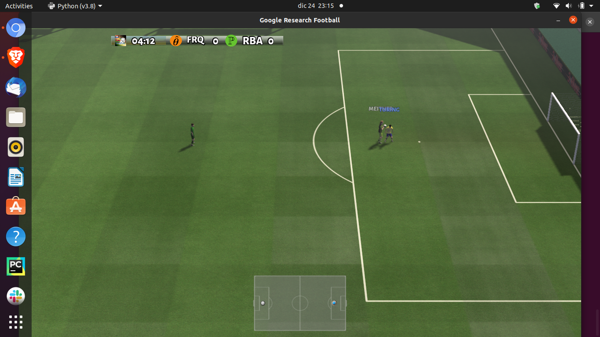
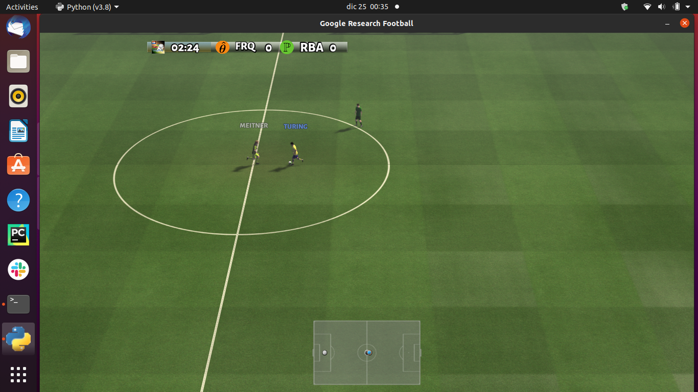
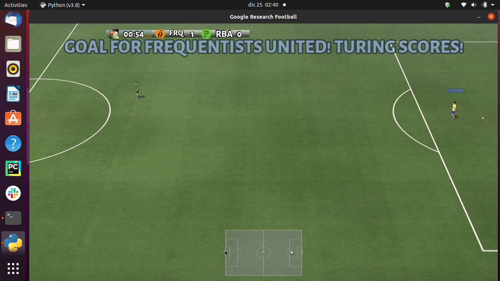

# December 20th
Experimenting with the given quick start colab notebook, changed the format to .py files instead of .ipynb files for easier testing.

## Original.py
The first file that I used is called **original.py**
This file is the first and only cell in the sample notebook after the installation cell.
I ran without any changes at all.

Full Script Below:

```python
import gfootball.env as football_env
env = football_env.create_environment(env_name="academy_empty_goal_close", stacked=False, logdir='/tmp/football', write_goal_dumps=False, write_full_episode_dumps=False, render=False)
env.reset()
steps = 0
while True:
  obs, rew, done, info = env.step(env.action_space.sample())
  steps += 1
  if steps % 100 == 0:
    print("Step %d Reward: %f" % (steps, rew))
  if done:
    break

print("Steps: %d Reward: %.2f" % (steps, rew))
```

The most notable argument here is the env_name, it is set to "academy_empty_goal_close".
The pygame GUI does is not rendered by default since the quick start colab notebook does not will not.

# December 20th 

```console
python3 original.py
```

## Trial #1
```output_stdout
Steps: 85 Reward: 0.00
```

# December 23rd
No Changes made to **original.py**

## Trial #2

#### Output
```output_stdout
Steps: 25 Reward: 1.00
```

So far no conlusions can be made since the second trial had different output than the first without any changes made.
It only seems that the reward given to the agent is a fuction of the steps taken - less steps actually gives a reward while more given less.

## Trial #3
Changed to log directory to the current directory to make it faster to find
Added the following (before the env variable declaration):

```python
import os

log_dir_tutorial = 'tutorial_logs' + '/'

if not os.path.exists(log_dir_tutorial):
     os.makedirs(log_dir_tutorial)
# Replaced the logdir='/tmp/football' with logdir=log_dir_tutorial
```

#### Output
```output_stdout
Step 100 Reward: 0.0000
Steps: 139 Reward: 0.00
```
Notice how after there is a print after the 100th step.
Also the conclusion made earlier that the more steps taken the reward is less.

## Trial #4
Changed to print every 5 steps (first if statement in the while loop)


```python
while True:
  obs, rew, done, info = env.step(env.action_space.sample())
  steps += 1
  if steps % 5 == 0:
    print("Step %d Reward: %f" % (steps, rew))
```

#### Output
```output_stdout
Step 5 Reward: 0.000000
Step 10 Reward: 0.000000
Step 15 Reward: 0.000000
Step 20 Reward: 0.000000
Step 25 Reward: 0.000000
Step 30 Reward: 0.000000
Step 35 Reward: 0.000000
Step 40 Reward: 0.000000
Step 45 Reward: 0.000000
Step 50 Reward: 0.000000
Step 55 Reward: 0.000000
Step 60 Reward: 0.000000
Step 65 Reward: 0.000000
Step 70 Reward: 0.000000
Step 75 Reward: 0.000000
Step 80 Reward: 0.000000
Step 85 Reward: 0.000000
Step 90 Reward: 0.000000
Step 95 Reward: 0.000000
Step 100 Reward: 0.000000
Step 105 Reward: 0.000000
Step 110 Reward: 0.000000
Step 115 Reward: 0.000000
Step 120 Reward: 0.000000
Steps: 121 Reward: 0.00
```

As we can see my assumptions are completely wrong so far therefore will need more experimentation to understand what is behind the increase/ decrease in rewards.
In other words, what causes the agents to be rewarded/ re-enforced.

## Trial #5
Made major changes to the original file.
First and foremost I wanted to render to game in order to see what was going on.
Also added a function that takes screenshots using pyautogui's _.screenshot_ function
Full Doc at Link: [pyautogui-screenshot function](https://pyautogui.readthedocs.io/en/latest/screenshot.html)

Lastly Started writing the output on a csv file including printing to console.

From what I am seeing is that after rendering the game is that the player takes a random action and it either goes forward into the goal **resulting in a reward of 1** or backwards and gets the ball taken away by defenders **resulting in a reward of 0**. The number of steps simply depends on how detremental the first action/ direction the player took until the player gets the ball taken away or scores.

Note: Will have to edit the file in order to have a better naming convention for the screenshots. I think this is a typical linux problem.

## Trial #6
The fist changes that I made to code for trial_5 is that instead of naming the screenshots per number I simply imported the time module and will name each by minute:seconds after the script started running. These changes were made in the _take\_screenshot.py_ script.

As I looked at the script, I saw that un-used variables obs and info and wondered what they represent.
Therefore also printed them to the terminal and csv file just to see.

Results: The observation looks a 3D numpy array. Will just print the shape for the next trial and maybe have it in it's own csv file.

## Trial #7 
First I printed the shape of the array and it was:
```output_stdout
(72, 96, 4)
```
I Just won't output it not put it into it's own csv file until I know what it is.

## Trial #8

Page 4 of the paper linked here: [Google Research Football: A Novel Reinforcement Learning Environment](https://arxiv.org/pdf/1907.11180.pdf)

Showed all of the action sets that the agents take.

| Table 1: Action Set |             |             |              |
|---------------------|-------------|-------------|--------------|
| Top                 | Bottom      | Left        | Right        |
| Top-Left            | Top-Right   | Bottom-Left | Bottom-Right |
| Short Pass          | High Pass   | Long Pass   | Shot         |
| Do-Nothing          | Sliding     | Dribble     | Stop-Dribble |
| Sprint              | Stop-moving | Stop-Sprint |              |

Taking a look at the following chunck of code in the script: 
```python 
While True:
  obs, rew, done, info = env.step(env.action_space.sample())
``` 

We can see the .sample() method meaning that the bot takes a sample from a pre defined action space.

In order to see which actions are available I did the following:
```python 
print(env.action_space)
``` 
and the following was the output:
```output_stdout
Discrete(19)
```
This means that the agent can take 19 possible actions in the game. 

While running the following command:
```python 
print(env.action_space.sample())
``` 

and the following was the output:
```output_stdout
4
```
This means at that particular run, the random sample gave the 4th action in the list.

## Trial #8

I was really intrigued as to which actions correspond to which integer from the list of 19.
Therefore thought of a way to hard code the actions, even though it defeats the purpose of RL simply to get an understanding of the football engine.
Using the following command, I was able to see all possible attributes fo teh _sction\_space_ method.

```python
print(dir(env.action_space))
```

and had the following was the output:
```output_stdout
['__class__', '__contains__', '__delattr__', '__dict__', '__dir__', '__doc__', '__eq__', '__format__', '__ge__', '__getattribute__', '__gt__', '__hash__', '__init__', '__init_subclass__', '__le__', '__lt__', '__module__', '__ne__', '__new__', '__reduce__', '__reduce_ex__', '__repr__', '__setattr__', '__sizeof__', '__str__', '__subclasshook__', '__weakref__', '_np_random', 'contains', 'dtype', 'from_jsonable', 'n', 'np_random', 'sample', 'seed', 'shape', 'to_jsonable']
```

From the available attributes I thought using _np\_random_ would work so I can specify a range of ints to be used as actions.
Therefore used the following command in order to see which action corresponds to 0.
```python
print(env.action_space.np_random(0,1))
```

Resulted in the following error
```output_stdout
Traceback (most recent call last):
  File "original_trial8.py", line 28, in <module>
    print(env.action_space.np_random(0,1))
TypeError: 'numpy.random.mtrand.RandomState' object is not callable
```

Therefore decised to look up the documentation for the _numpy.random.mtrand.RandomState_
The first suggestion from the google search was to use the _.choice()_ method. 
The official documentation can found at the following link:  [numpy.random.mtrand.RandomState.choice](https://docs.scipy.org/doc/numpy-1.17.0/reference/random/generated/numpy.random.mtrand.RandomState.choice.html)

Ran the following command:

```python
print(env.action_space.np_random.choice(1,1))
sys.exit()
```
With an output of :
```output_stdout
[0]
```
The results of the code implementation and screenshots can be see in the [trial8_logs](https://github.com/GateraGael/Google-Research-Football-Environment-Experiment/tree/main/ColabTutorial/trial8_logs) folder.

It can be confirmed that the action *0* corresponds to no action at all. Giving time to the oppostion to actually pick up the ball and throw it out for a corner kick which is very weird !



Did not get a chance to take the screenshot of when the player named "Meitner" throws the ball away. But believe me he does you have my code in this repo.
Just realized the naming convention for the screenshots are not what I wanted so will change the take_screenshot script.

## Trial #9

Since the documentation states that RandomState.choice(a, size=None, replace=True, p=None)
Generates a random sample from a given 1-D array

Parameters:	
a : 1-D array-like or int

I made the following changes to the while statement so I can control exactly which actions the agent is taking.

```python
while True:
    action_num = [1]

    obs, rew, done, info = env.step(env.action_space.np_random.choice(action_num,1))
```

The result was the agent going the complete other direction in a straight line and getting his ball taken away.



Complete code for the take_screenshot file just for the record.

```python
import pyautogui
import datetime

def take_amount_screenshots(num_screenshots, step_num, output_path):
    Minutes_Seconds_Now = datetime.datetime.now().strftime('%Mm%S')
    for i in range(num_screenshots):
        #savesceenshot directly to disk
        pyautogui.screenshot(output_path + Minutes_Seconds_Now + ".png")
        i += 1
```


## Trial #10

This is the latest trial of the Colab Tutoria for now as by now it is very very far away from being the original file.
Will create other directories with desciptive log such as this one as I experiment.

So action 5 is the action that makes Alan Turing dribble directly into the goal.

```python
action_num = [5]
```




